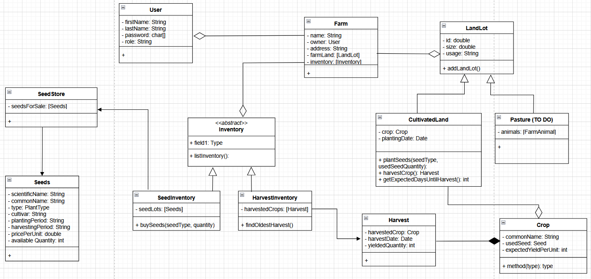

## FarmGO

### What?

FarmGO is a farm management software designed for small-scale farms, which offers various services, 
such as crop planning, inventory tracking and livestock monitoring, as well as a platform for local producers,
which can be used to promote their brand and sale their harvests, trade products with other farmers or organize local fairs. 
The ultimate goal is to create a shared space for local producers, to help them manage and promote their businesses
to new customers.

### Implementation details

#### Objects / Classes

- `User`
- `Farm`
- `LandParcel`
  - `CultivatedLand`
  - `Pasture` (TODO)
- `Seeds`:
- `SeedStore`
- `Inventory`
  - `SeedInventory`
  - `HarvestInventory`
- `Harvest`
- `Crop`

#### Methods / Actions

- As a Farmer, I can:
1. `buySeeds`
2. `plantSeeds`
3. `harvestCrop`
4. `listInventory`
5. `addLandLot`
6. `sellHarvest`
7. `analyzeHarvest`
8. `getExpectedDaysUntilHarvest`

- As a Visitor, I can:
1. `inspectMarket`
2. `buyProduce`

#### UML Class Diagram (DRAFT, will be revised)
