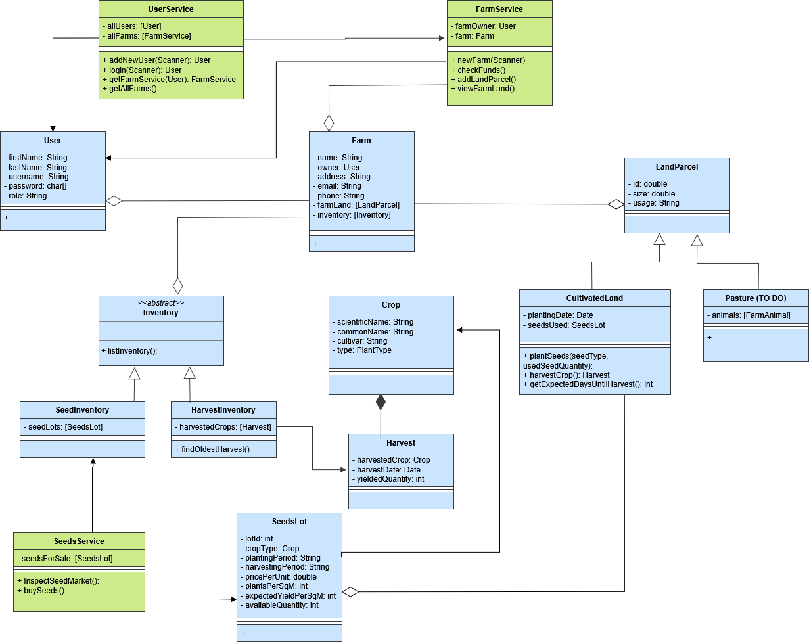

## FarmGO

### What?

FarmGO este o aplicatie de gestionare a fermelor, conceputa pentru
ferme de dimensiuni mici sau producatori locali. Aceasta isi propune
sa ofere atat servicii precum planificarea culturilor, inventarul stocurilor
si monitorizarea animalelor, cat si sa devina o platforma prin care
micii producatori isi pot promova produsele sau isi pot vinde recoltele, pot face troc
cu alti comercianti sau pot organiza targuri. Scopul este acela de a crea
un comunitate in care fermierii sa isi poata promova afacerile catre noi clienti.

### Detalii de implementare

#### Tipuri de obiecte

- `User`: un utilizator inregistrat in platforma, poate fi fermier (automat va avea si o ferma asociata)
sau simplu vizitator
- `Farm`: ferma propriu-zisa
- `LandParcel`: o parcela de pamant aflata in proprietatea fermei
  - `CultivatedLand`: un lot de teren petru culturi temporare (sezoniere)
  - `Pasture`: un lot de teren pe care doar pasc animale **_(to do)_**
  - `Orchard`: un lot de teren pentru culturi permanente **_(to do)_**
- `SeedsLot`: un lot de seminte pentru un anumit soi, pus la vanzare (de catre un fermier). Detine informatii despre perioadele 
de plantare si recoltare ale soiului, precum si o estimare a cantitatii recoltate (raportat la un metru patrat de teren agricol).
- `Inventory`: clasa abstracta, poate fi:
  - `SeedInventory`: depozitul de seminte (din care fermierul poate planta)
  - `HarvestInventory`: depozitul de recolte (in urma recoltarii, fructele/legumele/granele urmeaza sa fie depozitate
  pana la o prelucrare ulterioara)
  - `???` **_(to do)_**
- `Harvest`: recolta obtinuta de pe o parcela
- `Crop`: un soi dintr-o planta

#### Interogari ale sistemului

- As a Farmer, I can:
  - [x] `updateContactInfo`: actualizez informatiile de contact pentru ferma(email, telefon)
  - [x] `checkFunds`: verific bugetul curent 
  - [x] `inspectSeedMarket`: afiseaza caracteristicile semintelor care pot fi cumparate din platforma.
  Aceste informatii se regasesc in fisierul `seeds.csv`
  - [x] `buySeeds`: dintr-un lot de seminte aflat la vanzare, selectez o cantitate pe care vreau sa o cumpar. Consider ca 
tranzactia se realizeaza (automat) daca fermierul dispune de suficiente fonduri
  - [x] `listInventory`: afisez toate "itemele" aflate in depozitele fermei (prin "iteme" se vor intelege: stocul
  de seminte, stocul de recolte, stocul de produse)
  - [x] `addLandParcel`: fiecare proprietar de ferma isi poate incarca in aplicatie
  parcelele de pamant de care dispune, in functie de intrebuintarea lor
    (pot fi pentru culturi sezoniere, culturi permanente(livezi, vii) sau pasuni pe care pasc animale)
  - [ ] `plantSeeds`(to do)
  - [ ] `harvestCrop` (to do)
  - [ ] `sellHarvest` (to do)
  - [ ] `analyzeHarvest` (to do)
  - [ ] `getExpectedDaysUntilHarvest` (to do)
 

- As a Customer, I can:
  - [x] `viewFarms`: listeaza datele de contact ale tuturor fermelor
  - [ ] `inspectMarket` _(to do)_
  - [ ] `buyProduce` _(to do)_

- Functionalitati generale ale aplicatiei:
- [x] **login**
- [x] **register** ( `addNewUser` )

#### Diagrama UML de clase (draft!!)

